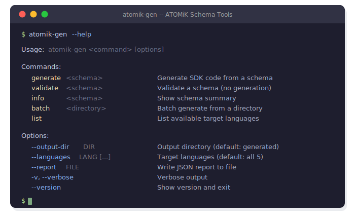

# ATOMiK Architecture

## Delta-State Computation in Silicon

> **IP & PATENT NOTICE**
>
> This repository contains software benchmarks, hardware description language (HDL) implementations, formal mathematical proofs, and validation artifacts for the **ATOMiK Architecture**.
>
> The underlying architecture, execution model, and methods demonstrated here are **Patent Pending**.
>
> While the source code in this repository is licensed under the **Apache License 2.0** for evaluation, testing, and benchmarking purposes, **no rights—express or implied—are granted to the underlying ATOMiK hardware architecture, execution model, or associated patents**.
>
> Commercial use, hardware integration, or derivative architectural implementations require a separate license.

---

## Development Status

| Phase | Description | Status | Milestone |
|-------|-------------|--------|-----------|
| **Phase 1** | Mathematical Formalization | ✅ **Complete** | 92 theorems verified in Lean4 |
| **Phase 2** | SCORE Comparison | ✅ **Complete** | 95-100% memory reduction validated |
| **Phase 3** | Hardware Synthesis | ✅ **Complete** | 10/10 hardware tests, 7% LUT @ 94.5 MHz |
| **Phase 4A** | SDK Code Generation | ✅ **Complete** | Python/Rust/C/JS/Verilog generators |
| **Phase 4B** | Domain SDKs | ✅ **Complete** | 3 domain SDKs, 57 generated files |
| **Phase 4C** | Autonomous Pipeline | ✅ **Complete** | 6-stage controller, hardware demos, 124 tests |
| **Phase 5** | Agentic Orchestration | ✅ **Complete** | DAG orchestrator, feedback loops, 242 tests |

**Latest**: Phase 5 transforms the Phase 4C linear pipeline into a self-improving agentic orchestrator with event-driven DAG execution, adaptive model routing, error pattern learning, deep verification, multi-agent coordination, and self-optimization. 25 new modules, 118 new tests (242 total).

Phase 5 complete (January 27, 2026). Agentic pipeline with feedback loops, cross-language consistency checking, regression detection, intelligent context management, and self-tuning. See [`docs/PHASE_5_ROADMAP.md`](docs/PHASE_5_ROADMAP.md) for architecture details.

Phase 4C complete (January 26, 2026). Autonomous 6-stage pipeline controller with hardware demos. See commit `a22095d` for details.

Phase 4B complete (January 26, 2026). Three domain SDK schemas (Video, Edge Sensor, Finance) validated and used to generate 57 production-ready files across 5 languages. See [`archive/PHASE_4B_COMPLETION_REPORT.md`](archive/PHASE_4B_COMPLETION_REPORT.md) for details.

Phase 4A complete (January 26, 2026). Multi-language SDK with 5 code generators (Python, Rust, C, JavaScript, Verilog) delivering production-ready implementations from JSON schemas. See [`archive/PHASE_4A_COMPLETION_REPORT.md`](archive/PHASE_4A_COMPLETION_REPORT.md).

Phase 3 complete (January 25, 2026). ATOMiK Core v2 validated on Tang Nano 9K FPGA with all delta algebra properties verified in silicon. See [`archive/PHASE_3_COMPLETION_REPORT.md`](archive/PHASE_3_COMPLETION_REPORT.md).

---

## The Core Idea

Traditional architectures store and retrieve complete state vectors. ATOMiK stores only **what changed** (deltas) and reconstructs state on demand:

```
Traditional:  State₁ → Store 64 bits → Load 64 bits → State₁
ATOMiK:       State₀ ⊕ Δ₁ ⊕ Δ₂ ⊕ ... ⊕ Δₙ = State_current (single XOR)
```

**Why this matters**:

| Advantage | Mechanism |
|-----------|-----------|
| **95-100% memory reduction** | Stream sparse deltas instead of dense state vectors |
| **Single-cycle operations** | XOR has no carry propagation—64-bit ops complete in one cycle |
| **Natural parallelism** | Commutativity enables lock-free multi-accumulator designs |
| **Reversibility built-in** | Self-inverse property (δ ⊕ δ = 0) enables undo without checkpoints |

---

## Mathematical Foundation

ATOMiK's delta operations form an **Abelian group** (Δ, ⊕, 𝟎), formally verified in Lean4:

| Property | Formula | Hardware Implication |
|----------|---------|---------------------|
| **Closure** | δ₁ ⊕ δ₂ ∈ Δ | Any delta combination is valid |
| **Associativity** | (δ₁ ⊕ δ₂) ⊕ δ₃ = δ₁ ⊕ (δ₂ ⊕ δ₃) | Tree reduction is mathematically sound |
| **Commutativity** | δ₁ ⊕ δ₂ = δ₂ ⊕ δ₁ | Order-independent parallel accumulation |
| **Identity** | δ ⊕ 𝟎 = δ | Zero-delta is no-op (filtering optimization) |
| **Self-Inverse** | δ ⊕ δ = 𝟎 | Instant undo—apply same delta to revert |

These properties enable **hardware optimizations impossible with traditional arithmetic**:
- **No carry propagation**: Unlike addition, XOR computes all 64 bits in parallel
- **Order independence**: Multiple hardware units can accumulate deltas without synchronization
- **Guaranteed reversibility**: No need to store checkpoints for undo operations

**Verification**: 92 theorems proven in Lean4, including Turing completeness via counter machine simulation. See [`math/proofs/`](math/proofs/).

---

## Performance

### Hardware-Validated Results

| Operation | Cycles | Latency @ 94.5 MHz |
|-----------|--------|-------------------|
| **LOAD** | 1 | 10.6 ns |
| **ACCUMULATE** | 1 | 10.6 ns |
| **READ** | 1 | 10.6 ns |

All operations are **single-cycle with identical cost**. There are no trade-offs between read and write performance.

### Memory Traffic Comparison

| Scenario | Traditional | ATOMiK | Reduction |
|----------|-------------|--------|-----------|
| 1000 state updates | 128 KB transferred | 0 KB (register-local) | **100%** |
| Streaming pipeline | Full state per stage | Delta per stage | **95-99%** |
| Parallel aggregation | Lock + full state sync | Lock-free delta merge | **Eliminates contention** |

### Parallelization Advantage

Because XOR is commutative and associative, multiple processing units can accumulate deltas **independently** and merge results **without locks**:

```
Unit A: acc_A = δ₁ ⊕ δ₃ ⊕ δ₅
Unit B: acc_B = δ₂ ⊕ δ₄ ⊕ δ₆
Final:  acc   = acc_A ⊕ acc_B  (same result regardless of distribution)
```

Phase 2 measured **85% parallel efficiency** in software. Hardware implementations can achieve near-linear scaling.

### Theoretical Projections

Because the ATOMiK datapath uses only XOR gates (no carry propagation), the critical path scales aggressively with process technology. Projected throughput on larger FPGA and ASIC platforms:

| Platform | Est. Frequency | Single-Acc Throughput | 8-Acc Throughput |
|----------|---------------|----------------------|-----------------|
| **Gowin GW1NR-9** (Tang Nano 9K) | 94.5 MHz | 94.5 Mops/s | 756 Mops/s |
| **Xilinx Artix-7** | ~300 MHz | ~300 Mops/s | ~2.4 Gops/s |
| **Xilinx UltraScale+** | ~500 MHz | ~500 Mops/s | ~4.0 Gops/s |
| **Intel Agilex** | ~600 MHz | ~600 Mops/s | ~4.8 Gops/s |
| **ASIC 28nm** | ~1 GHz+ | ~1 Gops/s | ~8 Gops/s |

**Multi-accumulator scaling**: Commutativity guarantees that N independent accumulators produce the same result regardless of delta distribution. Throughput scales linearly with accumulator count—no synchronization overhead.

---

## Hardware Implementation

### Phase 3 Results

| Metric | Result |
|--------|--------|
| **Target Device** | Gowin GW1NR-9 (Tang Nano 9K) |
| **Clock Frequency** | 94.5 MHz (Fmax: 94.9 MHz) |
| **Logic Utilization** | 7% (579/8640 LUTs) |
| **Register Utilization** | 9% (537/6693 FFs) |
| **Hardware Tests** | 10/10 passing |
| **Throughput** | 94.5 million operations/second |

### Architecture

<p align="center">
  
</p>

<details>
<summary>ASCII Version (click to expand)</summary>

```
┌─────────────────────────────────────────────────────────────┐
│                     ATOMiK Core v2                          │
│                                                             │
│  ┌─────────────────────┐    ┌─────────────────────────┐    │
│  │  Delta Accumulator  │    │  State Reconstructor    │    │
│  │                     │    │                         │    │
│  │  initial_state[63:0]├────►  XOR (combinational)    │    │
│  │         +           │    │         │               │    │
│  │  accumulator[63:0]  ├────►         ▼               │    │
│  │         ▲           │    │  current_state[63:0]    │    │
│  │         │           │    │                         │    │
│  │     XOR(delta_in)   │    └─────────────────────────┘    │
│  └─────────────────────┘                                   │
│                                                             │
│  All operations: 1 cycle                                   │
│    LOAD:       initial_state ← data_in                     │
│    ACCUMULATE: accumulator ← accumulator ⊕ data_in         │
│    READ:       data_out ← initial_state ⊕ accumulator      │
└─────────────────────────────────────────────────────────────┘
```
</details>

**Key insight**: The entire datapath uses only XOR gates and registers. No carry chains, no multipliers, no complex control logic. This is why single-cycle operation is achievable at high clock frequencies.

### Delta Algebra Verified in Silicon

| Property | Hardware Test | Result |
|----------|---------------|--------|
| Self-Inverse (δ ⊕ δ = 0) | Accumulate same delta twice | ✅ Returns to original state |
| Identity (S ⊕ 0 = S) | Accumulate zero | ✅ State unchanged |
| Closure | Accumulate multiple deltas | ✅ Correct composition |
| Load/Read roundtrip | Load → Read | ✅ Bit-exact match |

---

## SDK Architecture: Schema-Driven Code Generation

ATOMiK's SDK uses a **single JSON schema** to generate semantically equivalent implementations across 5 target languages:

<p align="center">
  
</p>

| Target | Output Type | Use Case |
|--------|-------------|----------|
| **Python** | Class with delta-state methods | Prototyping, data science, scripting |
| **Rust** | Struct with `impl` block | Systems programming, high-performance services |
| **C** | Header + implementation files | Embedded systems, kernel modules, bare-metal |
| **JavaScript** | ES module class | Web applications, Node.js services, browser-side |
| **Verilog** | RTL module + testbench | FPGA synthesis, ASIC design, hardware acceleration |

Each generator produces:
1. **Core implementation** — delta-state operations (LOAD, ACCUMULATE, READ, STATUS, ROLLBACK)
2. **Test suite** — verifies algebraic properties (self-inverse, commutativity, identity) in the target language
3. **Build configuration** — language-appropriate build files (Makefile, Cargo.toml, package.json, etc.)

### Phase 5: Agentic Pipeline Orchestrator

Phase 5 wraps the SDK generation pipeline in a self-improving agentic system:

<p align="center">
  
</p>

| Capability | Module | Description |
|------------|--------|-------------|
| **DAG Orchestration** | `pipeline/orchestrator.py` | Topological execution with parallel stage groups |
| **Event Bus** | `pipeline/event_bus.py` | Pub/sub event system connecting all stages |
| **Feedback Loop** | `pipeline/feedback.py` | Generate→Verify→Diagnose→Fix→Retry cycle |
| **Adaptive Routing** | `pipeline/agents/adaptive_router.py` | Multi-signal model selection (complexity, errors, budget) |
| **Token Efficiency** | `pipeline/agents/token_predictor.py` | Predictive budget, prompt caching, context compression |
| **Error KB** | `pipeline/knowledge/error_kb.py` | Fuzzy matching with auto-learning from fixes |
| **Deep Verify** | `pipeline/verification/deep_verify.py` | Native toolchain verification (pytest, gcc, cargo, node, iverilog) |
| **Consistency** | `pipeline/verification/consistency.py` | Cross-language interface checking with 5 extractors |
| **Parallel Execution** | `pipeline/parallel/executor.py` | Per-language parallel generation and verification |
| **Multi-Agent** | `pipeline/coordinator.py` | Coordinator + specialist agents + consensus |
| **Self-Optimization** | `pipeline/optimization/self_optimizer.py` | Auto-tune workers, retry depth, model routing |
| **Regression Gate** | `pipeline/regression/detector.py` | Baseline management with EMA updates |

<p align="center">
  
</p>

---

## Developer Tooling

### `atomik-gen` CLI Tool

A pip-installable command-line tool for schema validation and multi-language code generation. Install with `pip install -e ./software`.

<p align="center">
  
</p>

Options: `--output-dir`, `--languages`, `--report`, `--verbose`. See [API Reference](docs/SDK_API_REFERENCE.md#cli-tool-reference) for full details.

### VS Code Extension

The [ATOMiK Schema Tools](vscode-extension/atomik-vscode/README.md) extension provides:

- **JSON Schema intellisense** — autocompletion, validation, and hover docs for `*.atomik.json` and `**/schemas/**/*.json` files (uses `specs/atomik_schema_v1.json`, zero config)
- **Snippets** — `atomik-schema` (full skeleton), `atomik-field` (delta field), `atomik-hardware` (hardware section)
- **Command palette** — Generate, Validate, Batch Generate, and Show Info commands that invoke `atomik-gen`

```bash
cd vscode-extension/atomik-vscode && npm install && npm run compile
```

---

## What ATOMiK Is

- **A delta-state accelerator**: Single-cycle accumulation with O(1) state reconstruction
- **A formally verified architecture**: 92 theorems in Lean4, validated in silicon
- **A hardware-first design**: Verilog is the reference implementation
- **Inherently parallel**: Commutativity enables lock-free multi-unit designs
- **Naturally reversible**: Self-inverse property provides undo without checkpoints

## What ATOMiK Is Not

- **Not a general-purpose CPU**: No instruction fetch, branching, or general ALU
- **Not a cache replacement**: It's orthogonal—reduces the data that needs caching
- **Not limited to specific data types**: Any data representable as bit vectors works

## Ideal Use Cases

| Application | Why ATOMiK Fits | SDK Target |
|-------------|-----------------|------------|
| **Event sourcing** | Deltas are events; reconstruct state on demand | Python, Rust |
| **Streaming analytics** | Continuous delta accumulation, periodic state output | Python, C |
| **Financial tick processing** | High-frequency updates with sparse state queries | Rust, Verilog |
| **Sensor fusion** | Multiple delta streams merged via commutative XOR | C, Verilog |
| **Undo/redo systems** | Self-inverse property = instant reversion | JavaScript, Python |
| **Distributed aggregation** | Lock-free delta merge across nodes | Rust, C |
| **Video/image processing** | Frame deltas instead of full frames | C, Verilog |
| **Digital twins** | Delta-state synchronization between physical and virtual models | Python, JavaScript |
| **Database replication** | XOR-based change propagation with commutative merge | Rust, C |

---

## Repository Structure

```text
ATOMiK/
├── math/proofs/                 # ✅ Lean4 formal proofs (92 theorems)
├── rtl/                         # ✅ Verilog source (Phase 3 complete)
│   ├── atomik_delta_acc.v       # Delta accumulator module
│   ├── atomik_state_rec.v       # State reconstructor module  
│   ├── atomik_core_v2.v         # Core v2 integration
│   └── atomik_top.v             # Top-level with UART interface
├── experiments/                 # ✅ Phase 2 benchmarks (360 measurements)
├── constraints/                 # ✅ FPGA timing and physical constraints
├── synth/                       # ✅ Synthesis scripts (Gowin EDA)
├── scripts/                     # ✅ Hardware validation + FPGA pipeline + SDK generation
├── software/                    # ✅ Python SDK + pipeline + 5-language generators
│   ├── atomik_sdk/cli.py        # atomik-gen CLI tool (pip-installable entry point)
│   ├── atomik_sdk/generator/    # Schema-driven code generators (Py/Rust/C/JS/Verilog)
│   ├── atomik_sdk/pipeline/     # ✅ Phase 5 agentic orchestration (25 modules)
│   │   ├── orchestrator.py      # DAG-based pipeline orchestrator
│   │   ├── feedback.py          # Feedback loop with KB + LLM diagnosis
│   │   ├── coordinator.py       # Multi-agent coordinator
│   │   ├── agents/              # Adaptive routing, registry, token efficiency
│   │   ├── parallel/            # Task decomposition + parallel execution
│   │   ├── verification/        # Deep verify + consistency checking
│   │   ├── knowledge/           # Error pattern KB with fuzzy matching
│   │   ├── analysis/            # Metrics, regression detection, field diff
│   │   ├── context/             # Manifest, cache, intelligent context
│   │   └── optimization/        # Self-tuning + bottleneck analysis
│   └── atomik_sdk/tests/        # Test suite (242 tests)
├── vscode-extension/            # ✅ VS Code extension (schema intellisense + commands)
│   └── atomik-vscode/           # Extension source (TypeScript, snippets, schema)
├── sdk/schemas/                 # ✅ Schema definitions
│   ├── examples/                # Reference schemas (terminal-io, p2p-delta, matrix-ops)
│   └── domains/                 # Domain SDK schemas (video, edge-sensor, finance)
├── generated_sdks/              # ✅ Phase 4B generated code (3 domains x 5 languages)
├── docs/                        # SDK documentation and guides
├── specs/                       # Formal model and RTL architecture
├── archive/                     # Phase completion reports (historical)
└── impl/pnr/ATOMiK.fs           # ✅ FPGA bitstream (Tang Nano 9K)
```

---

## Quick Start

### Verify Mathematical Proofs
```bash
cd math/proofs && lake build
# All 92 theorems verified, 0 sorry statements
```

### Run Performance Benchmarks
```bash
cd experiments/benchmarks && python runner.py
# 360 measurements with statistical analysis
```

### Synthesize & Program FPGA
```powershell
cd synth && .\run_synthesis.ps1
openFPGALoader -b tangnano9k ..\impl\pnr\ATOMiK.fs
```

### Generate Domain SDKs
```bash
# Install CLI tool
cd software && pip install -e .

# Generate from a single schema
atomik-gen generate sdk/schemas/examples/terminal-io.json --output-dir generated

# Validate a schema
atomik-gen validate sdk/schemas/domains/video-h264-delta.json

# Batch generate all domain SDKs
atomik-gen batch sdk/schemas/domains/ --report generation_report.json
# 3 schemas → 57 files across Python, Rust, C, JavaScript, Verilog

# Show schema summary
atomik-gen info sdk/schemas/domains/finance-price-tick.json

# List available target languages
atomik-gen list
```

### Validate Hardware
```bash
python scripts/test_hardware.py COM6
# 10/10 tests passing
```

---

## Roadmap

| Phase | Status | Key Achievement |
|-------|--------|-----------------|
| **Phase 1**: Mathematical Formalization | ✅ Complete | 92 theorems, Turing completeness proven |
| **Phase 2**: Performance Benchmarking | ✅ Complete | 95-100% memory reduction, parallelization validated |
| **Phase 3**: Hardware Synthesis | ✅ Complete | Silicon validation, single-cycle operations confirmed |
| **Phase 4A**: SDK Code Generation | ✅ Complete | 5-language generators, 100% test coverage |
| **Phase 4B**: Domain SDKs | ✅ Complete | 3 domain schemas (Video/Edge/Finance), 57 generated files |
| **Phase 4C**: Autonomous Pipeline | ✅ Complete | 6-stage controller, hardware demos, 124 tests |
| **Phase 5**: Agentic Orchestration | ✅ Complete | DAG orchestrator, feedback loops, 25 modules, 242 tests |
| **Phase 6**: Multi-Accumulator Architecture | 📋 Planned | Parallel accumulator banks, linear throughput scaling |

### What the SDK Architecture Enables

The schema-driven code generation pipeline ensures that **every new ATOMiK object type automatically receives production-ready implementations in all 5 target languages**. This eliminates the gap between formal specification and production code:

- **One schema → five implementations**: Define a new delta-state object once in JSON; Python, Rust, C, JavaScript, and Verilog code is generated automatically.
- **Generated test suites**: Each generator produces tests that verify the algebraic properties (self-inverse, commutativity, identity) hold in the target language.
- **Semantic equivalence**: All generated implementations are semantically equivalent—proven by the same formal model verified in Phase 1.

**Phase 4B validated this at scale**: Three domain SDKs (Video H.264 Delta, Edge Sensor IMU Fusion, Financial Price Tick) generated 57 files across all 5 languages from 3 JSON schemas, with all algebraic properties verified in generated test suites.

**Phase 5 added self-improvement**: The pipeline now features event-driven DAG orchestration, feedback loops with error pattern learning, adaptive model routing, cross-language consistency checking, regression detection, and self-optimization. 242 tests verify the full system.

**Full roadmap**: [`archive/ATOMiK_DEVELOPMENT_ROADMAP.md`](archive/ATOMiK_DEVELOPMENT_ROADMAP.md) (historical) | [`docs/PHASE_5_ROADMAP.md`](docs/PHASE_5_ROADMAP.md) (current)

---

## Documentation

| Document | Description |
|----------|-------------|
| [SDK User Manual](docs/user/SDK_USER_MANUAL.md) | End-user guide for SDK usage |
| [SDK API Reference](docs/SDK_API_REFERENCE.md) | Complete API documentation (5 languages) |
| [SDK Developer Guide](docs/SDK_DEVELOPER_GUIDE.md) | SDK architecture and development |
| [Formal Model](specs/formal_model.md) | Delta-state algebra mathematical specification |
| [RTL Architecture](specs/rtl_architecture.md) | Hardware design specification and timing |
| [Schema Specification](docs/SDK_SCHEMA_GUIDE.md) | JSON schema format for code generation targets |
| [VS Code Extension](vscode-extension/atomik-vscode/README.md) | Schema intellisense, validation, and SDK generation |
| [Phase 5 Roadmap](docs/PHASE_5_ROADMAP.md) | Agentic orchestration architecture and task breakdown |
| [Phase 4B Report](archive/PHASE_4B_COMPLETION_REPORT.md) | Domain SDK generation completion report |
| [Phase 4A Report](archive/PHASE_4A_COMPLETION_REPORT.md) | SDK framework development completion report |
| [Phase 3 Report](archive/PHASE_3_COMPLETION_REPORT.md) | Hardware synthesis completion report |

---

## Licensing & Contact

Source files are provided under the **Apache License 2.0** for evaluation only, subject to the patent notice above. The Apache License 2.0 includes an explicit patent grant (Section 3) with a patent retaliation clause, providing clarity on IP rights for contributors and users.

For licensing inquiries, commercial integration, or architectural collaboration, please contact the repository owner.

---

*Last updated: January 27, 2026 — Phase 5 agentic orchestration (DAG orchestrator, feedback loops, 25 modules, 242 tests)*
