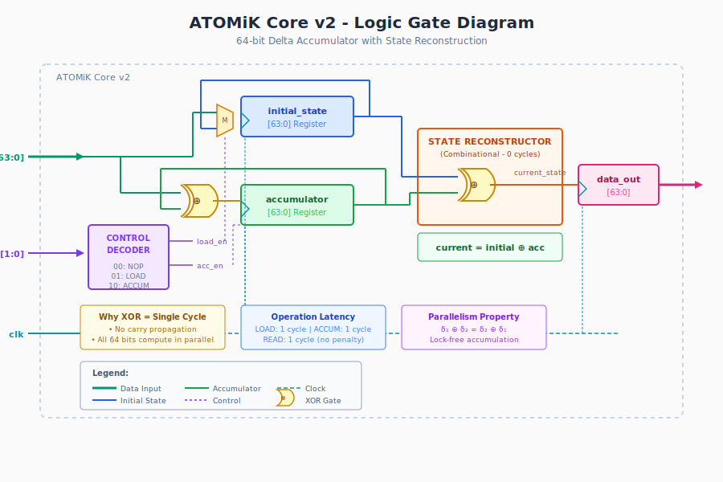
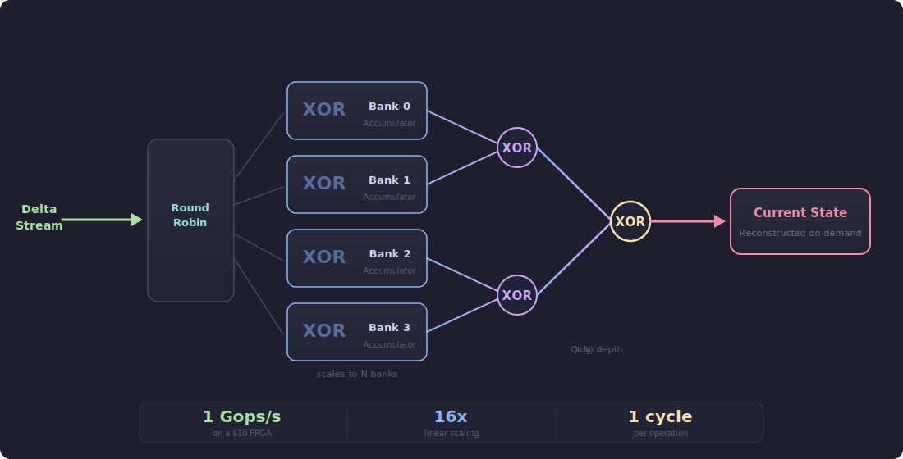
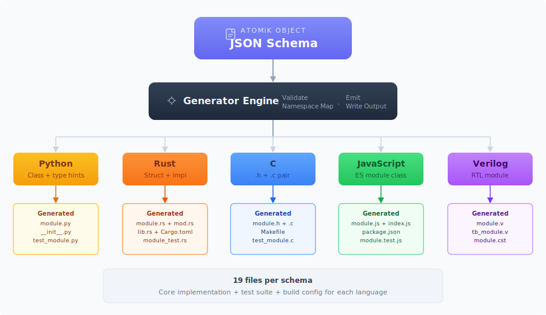

# ATOMiK Architecture


**Delta-State Computation in Silicon — 1 Billion Operations/Second on a $10 Chip**

> **IP & PATENT NOTICE**
>
> The underlying architecture, execution model, and methods are **Patent Pending**.
> Source code is licensed under **Apache License 2.0** for evaluation, testing, and benchmarking.
> Commercial use, hardware integration, or derivative architectural implementations require a separate license.

---

## Quick Start

```bash
# Clone and verify proofs
git clone https://github.com/MatthewHRockwell/ATOMiK.git && cd ATOMiK
cd math/proofs && lake build       # 92 theorems, 0 sorry

# Install SDK and run demo
cd ../../software && pip install -e ".[demo]"
python -m demo.run_demo --mode simulate --web

# Run state-sync benchmarks
python -m software.demos.state_sync_benchmark
```

---

## For Investors

- **One-Pager**: [`business/one_pager/atomik_one_pager.md`](business/one_pager/atomik_one_pager.md)
- **Data Room**: [`business/data_room/`](business/data_room/)
- **Pitch Deck**: [`business/pitch_deck/`](business/pitch_deck/)
- **Live Demo**: `python -m demo.run_demo --mode simulate --web` (runs at `localhost:8000`)
- **Benchmark Evidence**: `python -m software.demos.state_sync_benchmark`

**Key metrics**: $225 total development cost | 92 formal proofs | 80/80 hardware tests | 1 Gops/s on $10 FPGA | 5-language SDK | 353 tests passing

---

## For Engineers

- **Formal Proofs**: [`math/proofs/`](math/proofs/) — 92 Lean4 theorems including Turing completeness
- **RTL Source**: [`rtl/`](rtl/) — Verilog implementation validated on Tang Nano 9K
- **SDK**: `pip install -e ./software` — schema-driven code generation for Python/Rust/C/JS/Verilog
- **Phase 6 Synthesis**: [`docs/PHASE6_HARDWARE_SYNTHESIS.md`](docs/PHASE6_HARDWARE_SYNTHESIS.md) — 25-config sweep
- **API Reference**: [`docs/SDK_API_REFERENCE.md`](docs/SDK_API_REFERENCE.md)

---

## Publications

| Paper | Topic | Status |
|-------|-------|--------|
| [Delta State Algebra](papers/paper1-formal-verification/) | Formal verification of ATOMiK's algebraic foundations | Draft |
| [ATOMiK Benchmarks](papers/paper2-benchmarks/) | Performance benchmarks and SCORE comparison | Draft |

---

## Development Status

| Phase | Description | Status | Milestone |
|-------|-------------|--------|-----------|
| **Phase 1** | Mathematical Formalization | Complete | 92 theorems verified in Lean4 |
| **Phase 2** | SCORE Comparison | Complete | 95-100% memory reduction validated |
| **Phase 3** | Hardware Synthesis | Complete | 10/10 hardware tests, 7% LUT @ 94.5 MHz |
| **Phase 4A** | SDK Code Generation | Complete | Python/Rust/C/JS/Verilog generators |
| **Phase 4B** | Domain SDKs | Complete | 3 domain SDKs, 57 generated files |
| **Phase 4C** | Autonomous Pipeline | Complete | 6-stage controller, hardware demos, 124 tests |
| **Phase 5** | Agentic Orchestration | Complete | DAG orchestrator, feedback loops, 353 tests |
| **Phase 6** | Parallel Accumulator Banks | Complete | 16x linear scaling, 1056 Mops/s, 80/80 HW tests |

---

## The Core Idea

Traditional architectures store and retrieve complete state vectors. ATOMiK stores only **what changed** (deltas) and reconstructs state on demand:

```
Traditional:  State₁ → Store 64 bits → Load 64 bits → State₁
ATOMiK:       State₀ ⊕ Δ₁ ⊕ Δ₂ ⊕ ... ⊕ Δₙ = State_current (single XOR)
```

**Why this matters**:

| Advantage | Mechanism |
|-----------|-----------|
| **95-100% memory reduction** | Stream sparse deltas instead of dense state vectors |
| **Single-cycle operations** | XOR has no carry propagation—64-bit ops complete in one cycle |
| **Natural parallelism** | Commutativity enables lock-free multi-accumulator designs |
| **Reversibility built-in** | Self-inverse property (delta XOR delta = 0) enables undo without checkpoints |

---

## Mathematical Foundation

ATOMiK's delta operations form an **Abelian group**, formally verified in Lean4:

| Property | Formula | Hardware Implication |
|----------|---------|---------------------|
| **Closure** | d1 XOR d2 in Delta | Any delta combination is valid |
| **Associativity** | (d1 XOR d2) XOR d3 = d1 XOR (d2 XOR d3) | Tree reduction is mathematically sound |
| **Commutativity** | d1 XOR d2 = d2 XOR d1 | Order-independent parallel accumulation |
| **Identity** | d XOR 0 = d | Zero-delta is no-op (filtering optimization) |
| **Self-Inverse** | d XOR d = 0 | Instant undo—apply same delta to revert |

**Verification**: 92 theorems proven in Lean4, including Turing completeness via counter machine simulation. See [`math/proofs/`](math/proofs/).

---

## Performance

### Hardware-Validated Results

| Operation | Cycles | Latency @ 94.5 MHz |
|-----------|--------|-------------------|
| **LOAD** | 1 | 10.6 ns |
| **ACCUMULATE** | 1 | 10.6 ns |
| **READ** | 1 | 10.6 ns |

### Phase 6: Parallel Bank Throughput (Hardware-Validated)

| Banks | Frequency | Throughput | Scaling | Timing | HW Tests |
|------:|----------:|-----------:|--------:|:------:|:--------:|
| 1 | 94.5 MHz | 94.5 Mops/s | 1.0x | MET | 10/10 |
| 2 | 94.5 MHz | 189.0 Mops/s | 2.0x | MET | - |
| 4 | 81.0 MHz | 324.0 Mops/s | 4.0x | MET | 10/10 |
| 8 | 67.5 MHz | 540.0 Mops/s | 8.0x | MET | 10/10 |
| 16 | 66.0 MHz | 1056.0 Mops/s | 16.0x | MET | 10/10 |

N=16 breaks the **1 Gops/s barrier** on a $10 FPGA. Scaling is exactly linear at constant frequency.

### Projected Throughput

| Platform | Est. Frequency | Single-Acc | 16-Acc (projected) |
|----------|---------------|------------|-------------------|
| **Gowin GW1NR-9** (Tang Nano 9K) | 66-108 MHz | 108 Mops/s | **1,056 Mops/s** (validated) |
| **Xilinx Artix-7** | ~300 MHz | ~300 Mops/s | ~4.8 Gops/s |
| **Xilinx UltraScale+** | ~500 MHz | ~500 Mops/s | ~8.0 Gops/s |
| **Intel Agilex** | ~600 MHz | ~600 Mops/s | ~9.6 Gops/s |
| **ASIC 28nm** | ~1 GHz+ | ~1 Gops/s | ~16 Gops/s |

---

## Hardware Implementation

| Metric | Result |
|--------|--------|
| **Target Device** | Gowin GW1NR-9 (Tang Nano 9K) |
| **Clock Frequency** | 94.5 MHz (Fmax: 94.9 MHz) |
| **Logic Utilization** | 7% (579/8640 LUTs) |
| **Register Utilization** | 9% (537/6693 FFs) |
| **Hardware Tests** | 80/80 passing (all configurations) |
| **Throughput** | 1,056 Mops/s (16 banks) |

### Architecture

<p align="center">
  
</p>

<details>
<summary>ASCII Version (click to expand)</summary>

```
                         ATOMiK Core v2

  Delta Accumulator              State Reconstructor

  initial_state[63:0] ───────>  XOR (combinational)
         +                              |
  accumulator[63:0]   ───────>          v
         ^                       current_state[63:0]
         |
     XOR(delta_in)

  All operations: 1 cycle
    LOAD:       initial_state <- data_in
    ACCUMULATE: accumulator <- accumulator XOR data_in
    READ:       data_out <- initial_state XOR accumulator
```
</details>

### Parallel Accumulator Banks (Phase 6)

<p align="center">
  
</p>

| N_BANKS | LUT | ALU | FF | Fmax (MHz) | Throughput |
|--------:|----:|----:|---:|-----------:|-----------:|
| 1 | 477 | 40 | 537 | 96.0 | 94.5 Mops/s |
| 4 | 745 | 40 | 731 | 89.3 | 324 Mops/s |
| 8 | 1126 | 40 | 988 | 71.2 | 540 Mops/s |
| 16 | 1779 | 40 | 1501 | 63.7 | 1056 Mops/s |

---

## SDK Architecture: Schema-Driven Code Generation

<p align="center">
  
</p>

| Target | Output Type | Use Case |
|--------|-------------|----------|
| **Python** | Class with delta-state methods | Prototyping, data science |
| **Rust** | Struct with `impl` block | Systems programming, services |
| **C** | Header + implementation files | Embedded systems, bare-metal |
| **JavaScript** | ES module class | Web applications, browser-side |
| **Verilog** | RTL module + testbench | FPGA synthesis, ASIC design |

### Agentic Pipeline (Phase 5)

<p align="center">
  
</p>

DAG orchestration with feedback loops, adaptive model routing, cross-language consistency checking, regression detection, and self-optimization. See [`docs/PHASE_5_ROADMAP.md`](docs/PHASE_5_ROADMAP.md).

---

## Demo

The 3-node VC demo showcases ATOMiK across three Tang Nano 9K FPGAs (or in simulation):

```bash
python -m demo.run_demo --mode simulate --web    # Web dashboard at localhost:8000
python -m demo.run_demo --mode simulate           # TUI only
python -m demo.run_demo                           # Auto-discover hardware
```

| Node | Domain | Banks | Throughput | Demo Focus |
|------|--------|-------|-----------|------------|
| Node 1 | Finance | 4 | 324 Mops/s | Tick processing + instant undo |
| Node 2 | Sensor | 8 | 540 Mops/s | Multi-stream fusion + alerts |
| Node 3 | Peak | 16 | 1,070 Mops/s | 1 Gops/s milestone |

---

## Repository Structure

```text
ATOMiK/
├── math/proofs/              # Lean4 formal proofs (92 theorems)
├── rtl/                      # Verilog RTL source
├── sim/                      # Testbenches (single-core + parallel)
├── sweep/                    # Phase 6 synthesis sweep (25 configs)
├── software/                 # Python SDK + pipeline + generators
│   ├── atomik_sdk/           # SDK package (pip install -e ./software)
│   └── demos/                # State sync benchmarks
├── demo/                     # 3-node VC demo (TUI + web)
├── demos/                    # Domain hardware demos (finance/sensor/video)
├── business/                 # Investor materials + funding automation
│   ├── one_pager/            # Executive summary
│   ├── pitch_deck/           # Investor deck
│   ├── data_room/            # Due diligence documents
│   └── funding_strategy/     # Automated funding pipeline
├── papers/                   # Research publications
├── docs/                     # SDK documentation and guides
├── specs/                    # Formal model and RTL specs
├── sdk/schemas/              # JSON schema definitions
├── scripts/                  # Hardware validation scripts
├── vscode-extension/         # VS Code schema tools
└── archive/                  # Historical phase reports
```

---

## Documentation

| Document | Description |
|----------|-------------|
| [SDK User Manual](docs/user/SDK_USER_MANUAL.md) | End-user guide for SDK usage |
| [SDK API Reference](docs/SDK_API_REFERENCE.md) | Complete API documentation (5 languages) |
| [Formal Model](specs/formal_model.md) | Delta-state algebra mathematical specification |
| [RTL Architecture](specs/rtl_architecture.md) | Hardware design specification and timing |
| [Phase 6 Synthesis](docs/PHASE6_HARDWARE_SYNTHESIS.md) | Parallel bank synthesis sweep and HW validation |
| [Phase 5 Roadmap](docs/PHASE_5_ROADMAP.md) | Agentic orchestration architecture |

---

## Licensing & Contact

Source files are provided under the **Apache License 2.0** for evaluation only, subject to the patent notice above.

For licensing inquiries, commercial integration, or architectural collaboration, please contact the repository owner.
