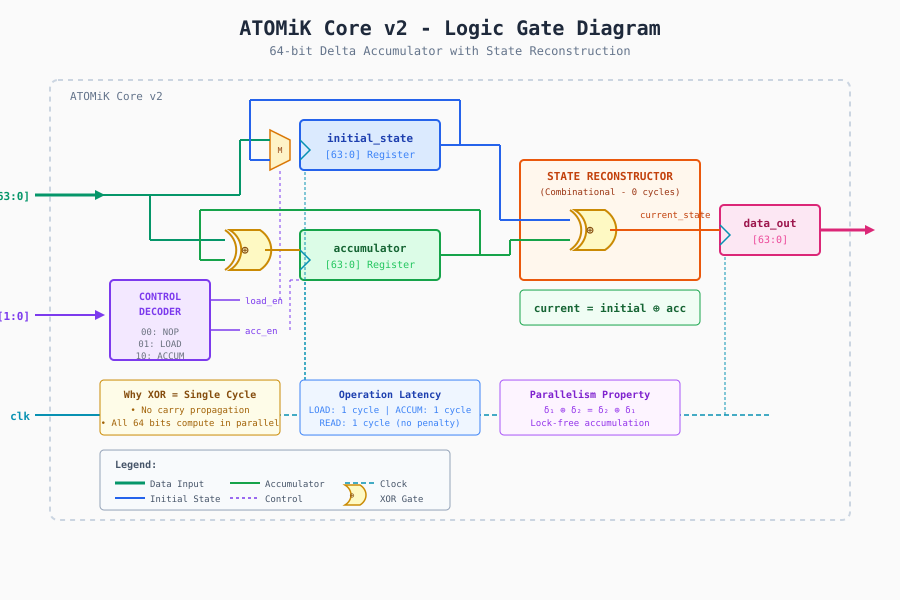
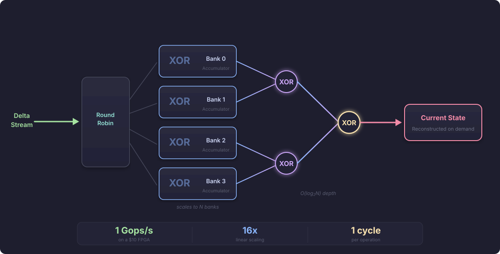
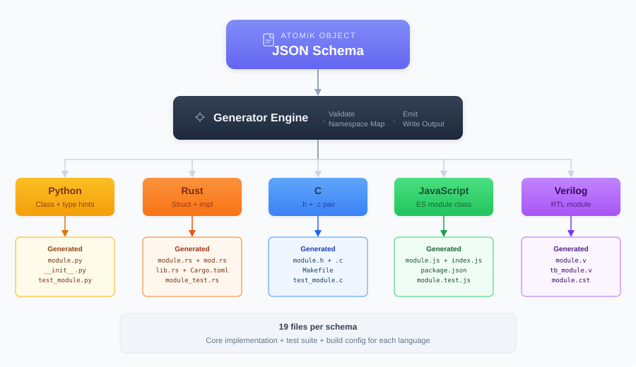
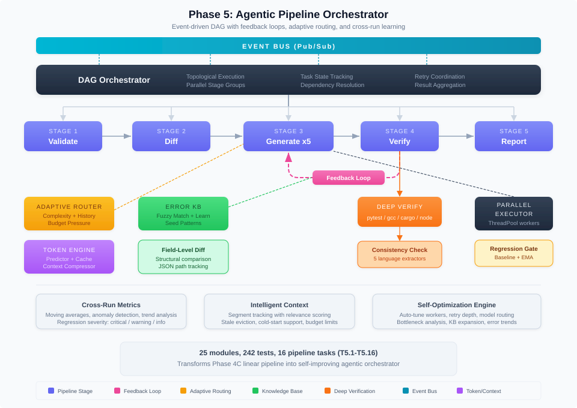

# ATOMiK Architecture

[](https://github.com/MatthewHRockwell/ATOMiK/actions/workflows/atomik-ci.yml)
[](https://github.com/MatthewHRockwell/ATOMiK/actions/workflows/review.yml)


**Delta-State Computation in Silicon — 1 Billion Operations/Second on a $13.50 Chip**

> **IP & PATENT NOTICE**
>
> The underlying architecture, execution model, and methods are **Patent Pending**.
> Source code is licensed under **Apache License 2.0** for evaluation, testing, and benchmarking.
> Commercial use, hardware integration, or derivative architectural implementations require a separate license.

---

## 🎯 Production Hardware

**Two production SoC generations deployed on Tang Nano 9K ($13.50):**

- ✅ **v2 SoC**: PicoRV32 + ATOMiK accelerator (25.2 MHz CPU, 81 MHz ATOMiK, dual-clock CDC)
- ✅ **v3 SoC**: Custom RV64I CPU + ATOMiK direct-wire (21.6 MHz CPU, 74.25 MHz pixel, 1280x720 HDMI)
- ✅ **8-screen auto-cycling HDMI demo**: Splash, self-test, performance, matrix integrity, energy, architecture, security, algebra
- ✅ **Persistent flash**: Bitstream + firmware in SPI flash, boots on power-up
- ✅ **Full validation**: All test suites passing (9/9 ATOMiK, 10/10 Phase 2, 6/6 Display)
- ✅ **Zynq port in progress**: AXI4-Lite wrapper for Xilinx XC7Z020 (ALINX AX7020), 52/52 sim tests

**Get the hardware:**
```bash
git clone https://github.com/MatthewHRockwell/ATOMiK.git && cd ATOMiK
# v3 SoC synthesis: cd hardware/v3/synth && make
# v3 persistent flash: openFPGALoader -b tangnano9k -f impl/pnr/atomik_v3_soc.fs
```

---

## Quick Start

```bash
# Clone and verify proofs
git clone https://github.com/MatthewHRockwell/ATOMiK.git && cd ATOMiK
cd math/proofs && lake build       # 92 theorems, 0 sorry

# Install SDK and run demo
cd ../../software && pip install -e ".[demo]"
python -m demos.run_demo --mode simulate --web

# Run state-sync benchmarks
python -m software.demos.state_sync_benchmark
```

---

## For Investors

- **One-Pager**: [`business/one_pager/atomik_one_pager.md`](business/one_pager/atomik_one_pager.md)
- **Data Room**: [`business/data_room/`](business/data_room/)
- **Pitch Deck**: [`business/pitch_deck/`](business/pitch_deck/)
- **Live Demo**: `python -m demos.run_demo --mode simulate --web` (runs at `localhost:8000`)
- **Benchmark Evidence**: `python -m software.demos.state_sync_benchmark`

**Key metrics**: $225 total development cost | 92 formal proofs | 80/80 hardware tests | 1 Gops/s | 5-language SDK | 353 tests passing

---

## For Engineers

- **Formal Proofs**: [`math/proofs/`](math/proofs/) — 92 Lean4 theorems including Turing completeness
- **RTL Source**: [`hardware/rtl/`](hardware/rtl/) (v2), [`hardware/v3/`](hardware/v3/) (v3) — Verilog implementations validated on Tang Nano 9K
- **SDK**: `pip install -e ./software` — schema-driven code generation for Python/Rust/C/JS/Verilog
- **Hardware Synthesis**: [`docs/HARDWARE_SYNTHESIS.md`](docs/HARDWARE_SYNTHESIS.md) — 25-config sweep
- **API Reference**: [`docs/SDK_API_REFERENCE.md`](docs/SDK_API_REFERENCE.md)

---

## Publications

| Paper | Topic | Status |
|-------|-------|--------|
| [Delta State Algebra](https://doi.org/10.5281/zenodo.18364796) |  Formally Verified Foundation for Transient State Computation | Preprint |
| [ATOMiK](https://doi.org/10.5281/zenodo.18372213) | mpirical Validation of Delta-State Computation with Hardware Verification | Preprint |

---

## Development Status

### Production Hardware (v2)
| Milestone | Description | Status |
|-----------|-------------|--------|
| **Mathematical Formalization** | 92 theorems verified in Lean4 | ✅ Complete |
| **SCORE Comparison** | 95-100% memory reduction validated | ✅ Complete |
| **Hardware Synthesis** | 10/10 hardware tests, 7% LUT @ 94.5 MHz | ✅ Complete |
| **SDK Generation Pipeline** | 6-stage controller, hardware demos, 5-language output | ✅ Complete |
| **Agentic Orchestration** | DAG orchestrator, feedback loops, 353 tests | ✅ Complete |
| **Parallel Accumulator Banks** | 16x linear scaling, 1,056 Mops/s, 80/80 HW tests | ✅ Complete |
| **Production SoC Deployment** | PicoRV32 + ATOMiK @ 25.2/81 MHz, persistent flash | ✅ Complete |

### Next-Generation Hardware (v3)
| Milestone | Description | Status |
|-----------|-------------|--------|
| **RV64I CPU Core** | Custom 64-bit RISC-V with integrated ATOMiK datapath | ✅ Complete (53/54 compliance) |
| **Timing Closure** | 21.6 MHz CPU, 74.25 MHz pixel, zero TNS | ✅ Complete |
| **Hardware Validation** | MMIO stress testing, 62/62 PASS | ✅ Complete |
| **Flash Boot Chain** | BROM → ISP timeout → SPI XIP execution | ✅ Complete (golden tag) |
| **ATOMiK Hardware Tests** | 9 ATOMiK + 10 Phase 2 tests on v3 hardware | ✅ Complete (9/9 + 10/10 PASS) |
| **Production SoC Deployment** | Tang Nano 9K @ 21.6 MHz, 0 TNS, persistent flash | ✅ **Deployed** |
| **Delta-Driven Display** | `pixel_out = pixel_ref ⊕ LUT[index]` — HDMI 1280×720@60Hz | ✅ Complete (6/6 PASS) |
| **8-Screen HDMI Demo** | Auto-cycling investor demo with gradient overlays | ✅ Complete |
| **Parallel Banks** | N=16 @ 67.5 MHz = 1,080 Mops/s, 20/20 sim tests | ✅ Complete (synthesis-validated) |
| **v2 vs v3 Benchmarks** | ATOMiK memcpy: +12% overhead → **-84.5% faster** | ✅ Complete (530 measurements, zero variance) |

### Zynq Port (ALINX AX7020 — XC7Z020)
| Milestone | Description | Status |
|-----------|-------------|--------|
| **AXI4-Lite Wrapper** | PS-to-PL interface with 32→64 bit bridging | ✅ Complete (52/52 sim tests) |
| **Vivado Build Infrastructure** | TCL scripts, block design, constraints, Makefile | ✅ Complete |
| **Reference Documentation** | Board pinout, PS config, AXI guide, Vivado build guide | ✅ Complete (13 docs) |
| **Hardware Bringup** | Synthesis + deployment on AX7020 | Pending (board on order) |

---

## The Core Idea

Traditional architectures store and retrieve complete state vectors. ATOMiK stores only **what changed** (deltas) and reconstructs state on demand:

```
Traditional:  State₁ → Store 64 bits → Load 64 bits → State₁
ATOMiK:       State₀ ⊕ Δ₁ ⊕ Δ₂ ⊕ ... ⊕ Δₙ = State_current (single XOR)
```

**Why this matters**:

| Advantage | Mechanism |
|-----------|-----------|
| **95-100% memory reduction** | Stream sparse deltas instead of dense state vectors |
| **Single-cycle operations** | XOR has no carry propagation—64-bit ops complete in one cycle |
| **Natural parallelism** | Commutativity enables lock-free multi-accumulator designs |
| **Reversibility built-in** | Self-inverse property (delta XOR delta = 0) enables undo without checkpoints |

---

## Mathematical Foundation

ATOMiK's delta operations form an **Abelian group**, formally verified in Lean4:

| Property | Formula | Hardware Implication |
|----------|---------|---------------------|
| **Closure** | d1 XOR d2 in Delta | Any delta combination is valid |
| **Associativity** | (d1 XOR d2) XOR d3 = d1 XOR (d2 XOR d3) | Tree reduction is mathematically sound |
| **Commutativity** | d1 XOR d2 = d2 XOR d1 | Order-independent parallel accumulation |
| **Identity** | d XOR 0 = d | Zero-delta is no-op (filtering optimization) |
| **Self-Inverse** | d XOR d = 0 | Instant undo—apply same delta to revert |

**Verification**: 92 theorems proven in Lean4, including Turing completeness via counter machine simulation. See [`math/proofs/`](math/proofs/).

---

## Performance

### Hardware-Validated Results

| Operation | Cycles | Latency @ 94.5 MHz |
|-----------|--------|-------------------|
| **LOAD** | 1 | 10.6 ns |
| **ACCUMULATE** | 1 | 10.6 ns |
| **READ** | 1 | 10.6 ns |

### Parallel Bank Throughput (Hardware-Validated)

| Banks | Frequency | Throughput | Scaling | Timing | HW Tests |
|------:|----------:|-----------:|--------:|:------:|:--------:|
| 1 | 94.5 MHz | 94.5 Mops/s | 1.0x | MET | 10/10 |
| 2 | 94.5 MHz | 189.0 Mops/s | 2.0x | MET | - |
| 4 | 81.0 MHz | 324.0 Mops/s | 4.0x | MET | 10/10 |
| 8 | 67.5 MHz | 540.0 Mops/s | 8.0x | MET | 10/10 |
| 16 | 66.0 MHz | 1056.0 Mops/s | 16.0x | MET | 10/10 |

N=16 breaks the **1 Gops/s barrier** on the Tang Nano 9K. Scaling is exactly linear at constant frequency.

### Projected Throughput

| Platform | Est. Frequency | Single-Acc | 16-Acc (projected) |
|----------|---------------|------------|-------------------|
| **Gowin GW1NR-9** (Tang Nano 9K) | 66-108 MHz | 108 Mops/s | **1,056 Mops/s** (validated) |
| **Xilinx Artix-7** | ~300 MHz | ~300 Mops/s | ~4.8 Gops/s |
| **Xilinx UltraScale+** | ~500 MHz | ~500 Mops/s | ~8.0 Gops/s |
| **Intel Agilex** | ~600 MHz | ~600 Mops/s | ~9.6 Gops/s |
| **ASIC 28nm** | ~1 GHz+ | ~1 Gops/s | ~16 Gops/s |

---

## Hardware Implementation

### Production Deployment (Tang Nano 9K SoC)

| Metric | Result |
|--------|--------|
| **Target Device** | Gowin GW1NR-9 (Tang Nano 9K) |
| **Architecture** | PicoRV32 RISC-V CPU + ATOMiK accelerator |
| **ATOMiK Configuration** | Single-bank @ 81 MHz with dual-clock CDC |
| **CPU Clock** | 25.2 MHz (PicoRV32 via SPI XIP) |
| **Timing Closure** | ATOMiK: 100.2 MHz (+23.6% margin), CPU: 30.6 MHz (+21.4% margin) |
| **Total Negative Slack** | 0.000 ns (all domains) |
| **Logic Utilization** | 44% (3,838/8,640 LUTs), 707 ALU, 72% CLS |
| **Flash Deployment** | Persistent SPI flash (bitstream + firmware) |
| **Validation** | 6/6 test suites passing ([X] [P] [K] [M] [H] [R]) |

### v3 SoC Deployment (Tang Nano 9K)

| Metric | Result |
|--------|--------|
| **Target Device** | Gowin GW1NR-9 (Tang Nano 9K) |
| **Architecture** | Custom RV64I CPU + ATOMiK direct-wire, dual-PLL (CPU + HDMI) |
| **CPU Clock** | 21.6 MHz (PLL 108 MHz ÷ 5) |
| **Pixel Clock** | 74.25 MHz (PLL 371.25 MHz ÷ 5) |
| **Timing Closure** | CPU: 21.6 MHz (+7.4% margin), Pixel: 74.25 MHz (+0.18% margin), zero TNS |
| **Logic Utilization** | 69% (5,966/8,640 LUTs), 88% CLS |
| **BSRAM** | 19/26 (74%) — regfile, state table, SRAM, BROM, SPI, HDMI, display LUT + scanline |
| **HDMI** | 1280x720@60Hz with delta-driven display pipeline |
| **Display Pipeline** | `pixel_out = pixel_ref ⊕ LUT[index]` — zero-cost unchanged pixels |
| **HDMI Demo** | 8-screen auto-cycling investor demo with gradient overlays and live ATOMiK tests |
| **Flash Deployment** | Persistent SPI flash (bitstream + firmware via ISP programmer) |
| **Parallel Banks (standalone)** | N=16 @ 67.5 MHz = 1,080 Mops/s (synthesis-validated, 20/20 sim tests) |
| **ATOMiK Memcpy Speedup** | 6.4x faster than software (v2 was 12% slower) |
| **Validation** | ATOMiK 9/9, Phase 2 10/10, Display 6/6 — all PASS |

### Standalone Core Performance

| Metric | Result |
|--------|--------|
| **Clock Frequency** | 94.5 MHz (Fmax: 94.9 MHz) |
| **Logic Utilization** | 7% (579/8640 LUTs) |
| **Register Utilization** | 9% (537/6693 FFs) |
| **Hardware Tests** | 80/80 passing (all configurations) |
| **Throughput** | 1,056 Mops/s (16 banks) |

### Architecture

<p align="center">
  
</p>

<details>
<summary>ASCII Version (click to expand)</summary>

```
                         ATOMiK Core v2

  Delta Accumulator              State Reconstructor

  initial_state[63:0] ───────>  XOR (combinational)
         +                              |
  accumulator[63:0]   ───────>          v
         ^                       current_state[63:0]
         |
     XOR(delta_in)

  All operations: 1 cycle
    LOAD:       initial_state <- data_in
    ACCUMULATE: accumulator <- accumulator XOR data_in
    READ:       data_out <- initial_state XOR accumulator
```
</details>

### Parallel Accumulator Banks

<p align="center">
  
</p>

| N_BANKS | LUT | ALU | FF | Fmax (MHz) | Throughput |
|--------:|----:|----:|---:|-----------:|-----------:|
| 1 | 477 | 40 | 537 | 96.0 | 94.5 Mops/s |
| 4 | 745 | 40 | 731 | 89.3 | 324 Mops/s |
| 8 | 1126 | 40 | 988 | 71.2 | 540 Mops/s |
| 16 | 1779 | 40 | 1501 | 63.7 | 1056 Mops/s |

---

## SDK Architecture: Schema-Driven Code Generation

<p align="center">
  
</p>

| Target | Output Type | Use Case |
|--------|-------------|----------|
| **Python** | Class with delta-state methods | Prototyping, data science |
| **Rust** | Struct with `impl` block | Systems programming, services |
| **C** | Header + implementation files | Embedded systems, bare-metal |
| **JavaScript** | ES module class | Web applications, browser-side |
| **Verilog** | RTL module + testbench | FPGA synthesis, ASIC design |

### Agentic Pipeline

<p align="center">
  
</p>

DAG orchestration with feedback loops, adaptive model routing, cross-language consistency checking, regression detection, and self-optimization. See [`docs/SDK_ORCHESTRATION.md`](docs/SDK_ORCHESTRATION.md).

---

## Demo

The 3-node VC demo showcases ATOMiK across three Tang Nano 9K FPGAs (or in simulation):

```bash
python -m demos.run_demo --mode simulate --web    # Web dashboard at localhost:8000
python -m demos.run_demo --mode simulate           # TUI only
python -m demos.run_demo                           # Auto-discover hardware
```

| Node | Domain | Banks | Throughput | Demo Focus |
|------|--------|-------|-----------|------------|
| Node 1 | Finance | 4 | 324 Mops/s | Tick processing + instant undo |
| Node 2 | Sensor | 8 | 540 Mops/s | Multi-stream fusion + alerts |
| Node 3 | Peak | 16 | 1,070 Mops/s | 1 Gops/s milestone |

---

## Repository Structure

```text
ATOMiK/
├── hardware/                 # FPGA/ASIC hardware design
│   ├── rtl/                  # v2 Verilog RTL source
│   ├── v3/                   # v3 SoC (RV64I + ATOMiK + HDMI + display pipeline)
│   │   ├── rtl/              # v3 CPU and ATOMiK RTL
│   │   ├── soc/              # SoC integration (peripherals, HDMI, firmware)
│   │   ├── synth/            # Gowin synthesis project and bitstream
│   │   └── sim/              # Verilator and iverilog testbenches
│   ├── zynq/                 # Zynq port (ALINX AX7020, XC7Z020)
│   │   ├── rtl/              # AXI4-Lite wrapper, clock module, PL top
│   │   ├── sim/              # iverilog testbench (52/52 PASS)
│   │   ├── vivado/           # TCL scripts (build, block design, program)
│   │   └── constraints/      # XDC timing constraints
│   ├── sim/                  # v2 testbenches (single-core + parallel)
│   ├── sweep/                # Parallel bank synthesis sweep (25 configs)
│   ├── synth/                # v2 synthesis output and reports
│   ├── scripts/              # Hardware validation scripts
│   ├── constraints/          # Timing and pin constraints
│   └── experiments/          # Hardware experiments
├── math/proofs/              # Lean4 formal proofs (92 theorems)
├── software/                 # Python SDK + pipeline + generators
│   ├── atomik_sdk/           # SDK package (pip install -e ./software)
│   └── demos/                # State sync benchmarks
├── demos/                    # 3-node VC demo (TUI + web) + domain hardware demos
├── business/                 # Investor materials + funding automation
│   ├── one_pager/            # Executive summary
│   ├── pitch_deck/           # Investor deck
│   ├── data_room/            # Due diligence documents
│   └── funding_strategy/     # Automated funding pipeline
├── papers/                   # Research publications
├── docs/                     # SDK documentation and guides
├── specs/                    # Formal model and RTL specs
├── sdk/                     # SDK: schemas, generated output, VS Code extension
│   ├── schemas/             # JSON schema definitions
│   ├── generated/           # Generated SDK output
│   └── vscode-extension/    # VS Code extension
└── archive/                  # Historical phase reports
```

---

## Documentation

| Document | Description |
|----------|-------------|
| [SDK User Manual](docs/user/SDK_USER_MANUAL.md) | End-user guide for SDK usage |
| [SDK API Reference](docs/SDK_API_REFERENCE.md) | Complete API documentation (5 languages) |
| [Formal Model](specs/formal_model.md) | Delta-state algebra mathematical specification |
| [RTL Architecture](specs/rtl_architecture.md) | Hardware design specification and timing |
| [Hardware Synthesis](docs/HARDWARE_SYNTHESIS.md) | Parallel bank synthesis sweep and HW validation |
| [SDK Orchestration](docs/SDK_ORCHESTRATION.md) | Agentic orchestration architecture |
| [Known Issues](docs/KNOWN_ISSUES.md) | Hardware/software issue tracker and troubleshooting |
| [Production Deployment](docs/PRODUCTION_DEPLOYMENT.md) | Tang Nano 9K v2 + v3 SoC deployment guide |
| [v3 Migration Guide](docs/V3_MIGRATION_GUIDE.md) | Porting firmware from v2 MMIO to v3 custom instructions |
| [v2 vs v3 Comparison](hardware/v3/experiments/V2_VS_V3_COMPARISON.md) | Head-to-head benchmark analysis |
| [v3 Task List](specs/atomik_v3_tasks.md) | v3 phased implementation tracker |
| [Zynq Port Tasks](specs/zynq_port_tasks.md) | Zynq ALINX AX7020 implementation tracker |
| [Zynq Architecture](specs/zynq_port_architecture.md) | AXI4-Lite wrapper and Zynq PS+PL architecture |
| [Vivado Build Guide](docs/reference/xilinx/VIVADO_BUILD_GUIDE.md) | Vivado TCL flow and block design reference |

---

## Licensing & Contact

Source files are provided under the **Apache License 2.0** for evaluation only, subject to the patent notice above.

For licensing inquiries, commercial integration, or architectural collaboration, please contact the repository owner.
