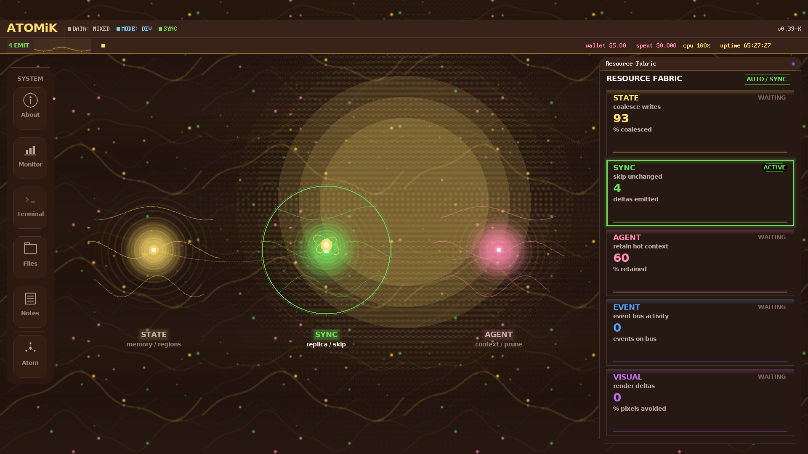

# ATOMiK

**State-aware compute evaluation for edge and embedded teams constrained by battery, heat, bandwidth, latency, reliability, or hardware footprint.**

## The Customer Problem

Many constrained systems spend too much work rediscovering what changed. They
move, scan, sync, replay, or rebuild state even when only a compact delta
matters. In edge and embedded systems, that waste can become battery drain,
thermal pressure, latency, bandwidth pressure, field-service risk, and hardware
overbuild.

Data-center power, cooling, water, and sustainability pressures matter, but they
are second-order expansion narratives until ATOMiK has workload-specific
measurement in that environment.

## What Customers Get

ATOMiK is evaluated where avoided state work may create business value:

- **Lower state-movement cost:** fewer bytes moved, transfers avoided, or scans skipped.
- **Faster constrained state paths:** lower update or reconstruction latency where the path fits.
- **Lower bandwidth pressure:** move compact deltas instead of repeated full-state updates when measured.
- **Power or thermal pressure reduction:** evaluation target when instrumentation or a responsible proxy exists.
- **Clear fit/no-fit evidence:** a decision about whether the workload justifies deeper evaluation.

Battery, heat, cooling, water, footprint, and hardware-profile improvements are
evaluation targets until measured on a specific workload.

## What ATOMiK Is

ATOMiK makes change the unit of compute:

```text
state = reference_state XOR accumulated_delta
```

It keeps a known reference state, accumulates compact deltas, reconstructs only
when needed, and commits clean state epochs. The architecture is intended for
state-heavy workloads where repeated scans, sync, replay, reconstruction, or
full-state movement dominate the cost; it is not positioned as a general-purpose
CPU replacement.

## Hardware-Validated UI Proof



**HARDWARE_VALIDATED:** ATOMiK Desk v0.39-K prototype UI running on live Zynq
hardware. This proves the current live demo surface, not commercial product
maturity, performance, power, thermal, battery, water, or footprint outcomes.

## Proof Stack

| Proof | Label | Status |
|---|---|---|
| Zynq Desk v0.39-K | `HARDWARE_VALIDATED` | current public proof image |
| Linux userspace to FPGA path | `HARDWARE_VALIDATED` | documented OS-to-bus validation path |
| AX7020 board run matrix | `LIVE_MEASURED` | raw artifact with interpretation caveats and workload-specific wins/losses |
| Formal proof work | `SOFTWARE_VALIDATED` | algebraic proof work in repo; avoid public counts until audited across materials |
| Standalone SD boot artifacts | `BUILD_ARTIFACT` | local build output exists; public power-on artifact is still a gate |

## Target Use Cases

| Segment | Buyer pain | Evaluation metric |
|---|---|---|
| Edge / embedded systems | battery budget, enclosure heat, intermittent links, reliability | bytes moved, update latency, bandwidth, power proxy |
| AI at the edge | context/state movement, memory pressure, local response | transfers avoided, context retained, response latency |
| Remote / industrial / robotics / defense-adjacent | wattage, packet budget, field runtime, size/weight | runtime proxy, packet budget, update cost, reliability signal |
| Data center / infrastructure | power bill, cooling, water pressure, rack density | bytes moved, power/thermal proxy, measured workload energy path |

The lead customer is the edge or embedded team that can bring one state-heavy
workload, one current baseline, and one painful constraint.

## Evaluation Offer

Give us one state-heavy workload, your current baseline, and the constraint that
already hurts. We evaluate where state movement creates waste and whether ATOMiK
can improve the path. You receive a workload map, baseline comparison, evidence
map, fit/no-fit recommendation, and next-step plan. Success looks like measured
improvement against one agreed metric while preserving correctness.

## Business Path

Near term: paid proof reviews, technical evaluations, design partners, IP
strengthening, and ASIC feasibility review.

Longer term: strategic licensing or integration partnership optionality only if workload proof and IP diligence justify it.

## Pre-Seed Use Of Funds

- Convert provisional IP protection into stronger patent coverage.
- Run customer workload evaluations around state paths tied to battery, heat, power, bandwidth, latency, and footprint pressure.
- Bring in fractional CFO support for valuation and financing structure.
- Add ASIC mentorship before any tape-out decision.
- Package the Zynq demo into a lower-friction investor and customer proof system.

## Financial Discipline

The current working ask is a $2.0M target pre-seed, with a $1.25M minimum viable
close and a $2.75M stretch plan. The round funds customer workload measurements,
IP strengthening, CFO-reviewed financing structure, demo hardening, and ASIC
feasibility. It does not fund tape-out.

Market benchmarks are context only: IEA/LBNL support the energy, cooling, and
water-pressure urgency; Carta/PitchBook/NVCA support financing market context;
SIA/WSTS supports the semiconductor-market backdrop. None of those sources prove
ATOMiK savings or set ATOMiK's valuation.

## Ask

ATOMiK is seeking a $2.0M target pre-seed, design-partner introductions,
ASIC/IP diligence support, and customer workloads where battery, heat, power,
bandwidth, latency, reliability, or footprint are already painful. Final
financing terms require CFO/counsel approval.

## Contact

Request an investor briefing, technical evaluation, or design-partner
conversation: `matthew.h.rockwell@gmail.com`

## Evidence Boundary

Live screenshots show current prototypes. Concept visuals show product direction
and are not represented as current commercial functionality. Performance,
thermal, water, battery, and footprint claims are only stated when backed by
measured artifacts for that exact claim.
