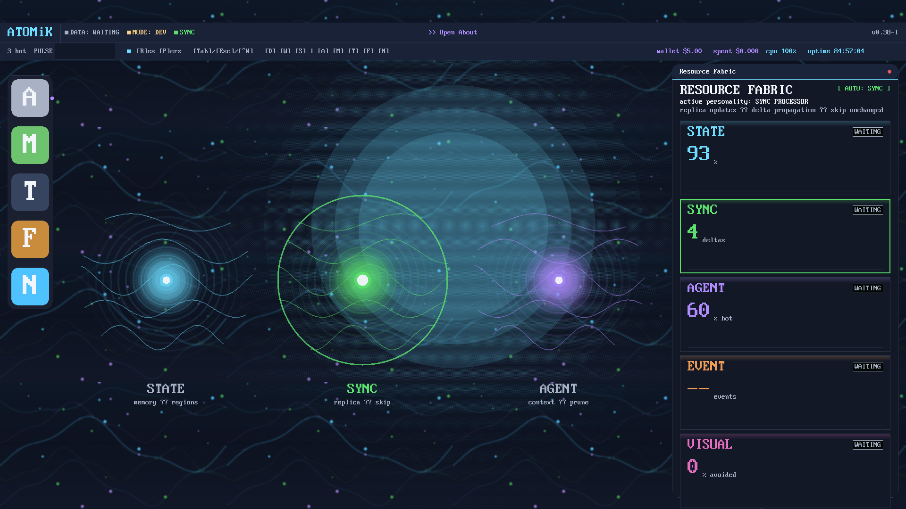

# ATOMiK

**State-aware execution for systems that waste too much work rediscovering what changed.**

## Problem

Most modern systems still move, copy, replay, and rescan full state even when
only a small delta matters. That creates unnecessary bandwidth usage,
synchronization complexity, rollback overhead, and wasted compute.

## Solution

ATOMiK makes state change a first-class computational primitive. It applies
compact deltas, reconstructs state on demand, and enables more efficient sync
and adaptive execution paths for edge, embedded, and distributed systems.

## Live Proof

**HARDWARE_VALIDATED:** ATOMiK Desk v0.38-I prototype UI running on live hardware.

ATOMiK has public software artifacts, formal proof work, benchmark outputs, and
hardware-backed demo surfaces. Public proof is labeled by validation tier so
measured, synthesis-derived, projected, and conceptual claims stay separate.

## Concept / Roadmap Vision

ATOMiK Desk and Resource Fabric show how the same architecture can evolve into
a state-aware compute environment where workloads reorganize around changing
context instead of static application silos.

Concept visuals are clearly labeled and are not represented as current commercial
functionality.

## Target Customer

Engineering and platform teams working on state-heavy edge systems, sync-heavy
distributed systems, embedded deployments, or adaptive execution environments.

## Initial Wedge

Delta-native sync and execution for workloads where full-state movement is too
expensive.

## Business Model

Near term: evaluations and design-partner engagements.

Longer term: enterprise support, integration, targeted licensing, and broader
platform economics.

## Why Now

As compute shifts toward edge AI, appliance-like systems, and heterogeneous
workloads, the cost of memory movement, synchronization, and orchestration waste
is becoming harder to ignore.

## Design Partner Ask

Bring ATOMiK one real workload, one real bottleneck, and one internal champion.
We will define success criteria together and determine whether there is real
deployment fit.

## Contact CTA

Request a technical briefing, evaluation access, or a design-partner
conversation: `mrockwell@atomik.tech`

## Evidence Disclaimer

Live screenshots show current prototypes. Concept visuals show product direction
and are not represented as current commercial functionality. Performance claims
are only stated when backed by measured artifacts.
