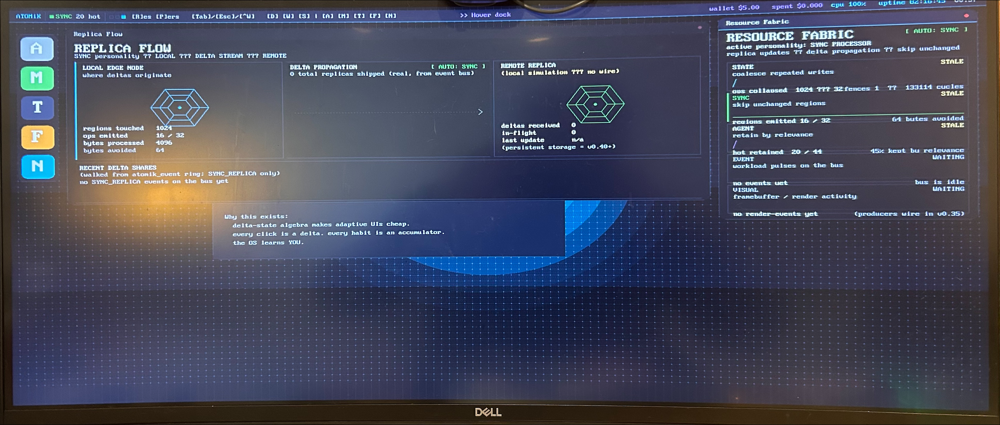
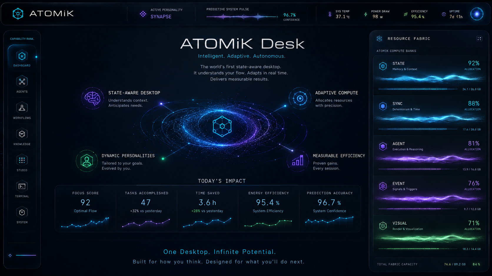

# ATOMiK

## State-aware execution for systems that waste too much work rediscovering what changed

<small>HARDWARE_VALIDATED live prototype available</small>

---

# The Problem

Modern systems repeatedly move, replay, and rescan full state even when change
is sparse.

- full-state copies
- replay-heavy reconstruction
- expensive change detection
- rollback and sync overhead

---

# The Primitive

ATOMiK makes state change a first-class compute primitive.

```
reference state + compact deltas -> reconstruct on demand
```

---

# Why Customers Care

Less unnecessary state movement.

Cleaner rollback.

Simpler synchronization.

More adaptive execution around what actually changed.

---

# Live Proof Today



<small>HARDWARE_VALIDATED: Current ATOMiK Desk prototype running on live hardware.</small>

---

# Initial Wedge

Start where state movement pain is acute:

- edge and embedded systems
- sync-heavy distributed systems
- rollback-sensitive paths
- adaptive execution surfaces

---

# Adoption Path

1. Explore the primitive in software
2. Test it against one real workload
3. Move into hardware-backed evaluation where justified
4. Assess broader integration only after fit is clear

---

# ATOMiK Desk + Resource Fabric



<small>CONCEPTUAL: ATOMiK Desk concept visual - target product direction, not current live UI.</small>

---

# Business Model

Near term:

- evaluation access
- paid technical evaluations
- design-partner engagements

Longer term:

- support
- integration
- targeted licensing
- enterprise deployment paths

---

# Competition

The first competitor is the status quo:

full-state movement, replay, rescans, and expensive orchestration treated as
normal.

---

# Roadmap

Every public claim carries a tier:

`LIVE_MEASURED` `HARDWARE_VALIDATED` `SOFTWARE_VALIDATED`

`SYNTHESIS_VALIDATED` `PROJECTED` `CONCEPTUAL` `ROADMAP`

---

# Ask

Bring one real workload, one technical champion, and one success criterion worth
testing.

Design partners, technical advisors, and investor conversations are the current
priority.
