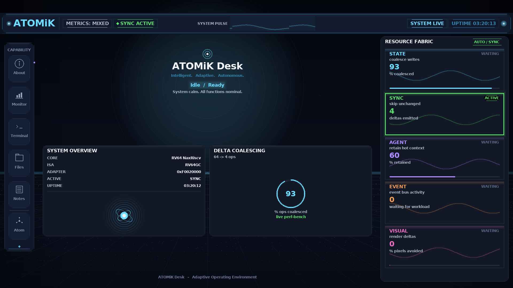

# ATOMiK

## Make change the unit of compute

State-aware compute evaluation for edge and embedded teams constrained by battery, heat, bandwidth, latency, reliability, size, weight, or hardware footprint.

Pre-seed target: **$5M**. Final SAFE mechanics, valuation cap, discount, and close structure require CFO/counsel review.

---

# Customers Already Know The Pain

- Batteries die too quickly.
- Hardware is maxed out.
- Systems run hot.
- Devices are too big or too heavy.
- Costs keep increasing.
- More performance is needed.

Before customers spend more money on bigger hardware, larger batteries, cooling, bandwidth, or redesign, ATOMiK checks whether a constrained state path can get more out of the system they already have.

---

# End-Game Value

Customers do not buy delta-state algebra. They buy measured evidence that a constrained state path can improve.

Evaluation metrics can include bytes moved, full-state transfers avoided, operations coalesced, update latency, reconstruction cost, power or thermal proxy where responsibly measured, and correctness preservation.

Battery, cooling, water, power-bill, and footprint outcomes remain evaluation targets until workload-specific measurement exists.

---

# Market Opportunity

TAM context: **$1T+** 2026 semiconductor revenue backdrop.

SAM context: **$112B-$169B** embedded systems market range from 2024 estimate to 2030 forecast, with edge AI as adjacent pressure.

Entry wedge: **$10M-$40M** early annual revenue path from paid evaluations, design partners, and licensing if proof converts; not a ceiling.

Semiconductor IP context: **$8.14B 2025 to $11.2B 2029**.

These are market context and founder-prepared planning targets, not ATOMiK forecasts or guaranteed revenue.

---

# Focus Markets

Expected growth trajectories for focus segments:

- Edge AI: $24.9B in 2025 to $118.7B in 2033, 21.7% CAGR.
- Smart robots / robotics: $33.8B in 2024 to $131.5B in 2030, 26.5% CAGR.
- Commercial drones / remote autonomy: $30.0B in 2024 to $54.6B in 2030, 10.6% CAGR.
- Nanosatellite and microsatellite / remote sensing: $4.0B in 2024 to $14.0B in 2030, 22.8% CAGR.

Potential target-account examples only, with no customer relationship implied: NVIDIA Jetson ecosystem, Qualcomm, Ambarella, Hailo, Advantech; Rockwell Automation, Siemens, ABB, FANUC, Universal Robots; Skydio, AeroVironment, Anduril, Shield AI, Teledyne FLIR; Planet, Spire, BlackSky, Maxar, Rocket Lab.

---

# Competitive Landscape

Buyer alternatives and status quo references:

- More silicon / accelerators: NVIDIA Jetson, Qualcomm, Ambarella, Hailo, Google Coral, FPGA upgrades from AMD/Xilinx, Intel/Altera, Lattice.
- Processor and IP incumbents: Arm, Synopsys ARC, Cadence Tensilica, CEVA, Andes/RISC-V ecosystem, Imagination.
- Software/status quo: compression, caching, dedup, delta sync, CRDT/event sourcing, hand optimization, bigger batteries, more cooling.

Defensibility wedge: Lean4-checked formal algebra + FPGA hardware validation + IP/proof registry. Exact formal claims stay tied to audited properties.

---

# The Primitive

ATOMiK makes change the unit of compute.

```text
state = reference_state XOR accumulated_delta
```

LOAD sets the reference. ACCUM adds changes. READ reconstructs. SWAP commits a boundary.

---

# Fit Discipline

ATOMiK has a wedge, not a universal claim.

Best-fit signals: updates dominate reads, state changes are sparse, bandwidth or latency is expensive, power budget or hardware margin is tight, and sync/replay/context retention creates overhead.

Not the claim: CPU/GPU/NPU replacement, universal speedup, or battery/thermal result before measurement.

---

# Use Cases

Potential buyers include robotics, edge AI, industrial systems, remote systems such as drones and satellites, and defense-adjacent environments.

The common trigger is expensive pressure from battery life, heat, size, weight, hardware limits, latency, performance, reliability, or rising cost.

---

# Hardware-Validated UI Proof



`HARDWARE_VALIDATED` capture of ATOMiK Desk v0.40-A from `/dev/fb0` on Zynq hardware. The OS renders and is driven by real measured on-board data. Not a real-time interactive demo and not customer workload proof.

This screenshot is not customer workload proof, production-readiness proof, battery proof, thermal proof, water proof, or footprint proof.

---

# Proof Stack

| Proof | Label | Status |
|---|---|---|
| Zynq Desk v0.40-A | `HARDWARE_VALIDATED` | current UI proof image, captured from `/dev/fb0` |
| Parallel-bank throughput on AX7020 | `LIVE_MEASURED` | 8-bank accumulator scales 1/2/4/8x, byte-identical to software |
| Linux userspace to FPGA path | `HARDWARE_VALIDATED` | documented OS-to-bus validation path |
| AX7020 board matrix | `LIVE_MEASURED` | raw artifact with wins and losses |
| Lean4-checked formal algebra | `FORMAL_PROOF` where directly audited | exact audited properties only |
| Standalone SD boot artifacts | `BUILD_ARTIFACT` | local build output exists; public run proof still gated |

Every proof claim requires artifact, context, and caveat.

---

# Where We Are / What v0.40 Funds

**Today (v0.40-A, `HARDWARE_VALIDATED`):** the ATOMiK Desk shell runs on real silicon — Capability Rail, 5-lane Resource Fabric (STATE / SYNC / AGENT / EVENT / VISUAL), semantic Pulse Bar, personality hero — captured from `/dev/fb0` on a Zynq AX7020, with on-screen metrics driven by real measured on-board data. The display path is `HARDWARE_VALIDATED` at 1080p30 over HDMI (1080p60 is physically impossible on this board: an OSERDES2 pulse-width limit).

**Measured throughput substrate (`LIVE_MEASURED`):** an 8-bank ATOMiK XOR accumulator scales linearly with allocated banks on the AX7020 — 1/2/4/8 banks complete the same work in 1/2/4/8x fewer cycles (about 100 to 800 Mdeltas/s at the 100 MHz sys clock) — with a byte-identical result across every bank count that matches a software recompute. This is the throughput substrate, not a customer-workload speedup.

**Active bring-up, not yet validated:** standalone SD boot is `BUILD_ARTIFACT` only. The interactive Workloads demo and USB keyboard/mouse input are software-complete and host-verified but not board-confirmed (unified bitstream building; USB input gated on a VBUS/power path). The currently validated path is JTAG-assisted; public power-on boot artifact remains gated.

**v0.40 funds the move from proof artifacts to repeatable demo and productization:**

- Document, Replica Flow, Agent, and Build Lane surfaces lifted into the desk shell as full-frame routes (substrate already ships in `atomik_os` v1.0)
- Palette and per-lane waveform pass against the ATOMiK Desk concept art
- Standalone SD boot promoted from build artifact to validated power-on
- Recorded video proof for website and investor leave-behinds

**The substrate exists. v0.40 is composition, not invention.**

---

# Commercial Path

1. Customer shows the constrained part of the system causing problems.
2. ATOMiK evaluates whether it can run faster, use less power, reduce hardware requirements, or improve efficiency against the current baseline.
3. If there is an opportunity, ATOMiK shows where it is, what was measured, and the potential impact.
4. If there is no fit, ATOMiK says so and stops before wasting customer time.

Design-partner work and licensing diligence come only after measured proof supports the path.

---

# Financial Model

Founder-prepared planning scenario, not a forecast.

| Period | Planning range | Meaning |
|---|---:|---|
| 0-6 months | $0-$150K | qualified proof reviews / technical evals |
| 6-12 months | $250K-$750K | paid evaluation or design-partner SOWs |
| 12-24 months | $1M-$3M | potential contracted value if proof converts |
| 24-36 months | $3M-$8M | annualized potential if proof and economics hold |

Use of funds: `$1.5M` engineering, `$1.0M` customer proof, `$750K` IP/legal, `$750K` ASIC feasibility, `$1.0M` finance/GTM/ops plus reserve.

---

# Risks And Gates

Customer validation is pending. Battery, heat, cooling, water, power-bill, and footprint outcomes need end-to-end workload measurement. ASIC economics require external feasibility review before tape-out. Incumbents are real.

These risks are why this is a proof round, not a tape-out round.

---

# Team

Matthew H. Rockwell, Founder & CEO: architecture, live proof, product direction, financial model, ask, and technical Q&A.

Allison Rossi, CMO: messaging, positioning, buyer-language, commercialization, and go-to-market support.

---

# The Ask

ATOMiK is raising a **$5M target pre-seed** to reach measured workload proof.

Need: capital, qualified workloads, design-partner introductions, investor feedback, and diligence support.

This round funds measured workload proof, IP packet, ASIC feasibility, and licensing-ready materials. It does not fund tape-out.
